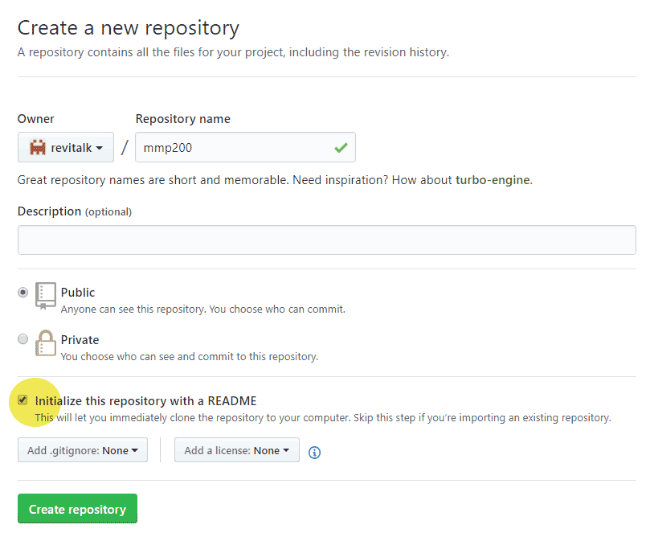
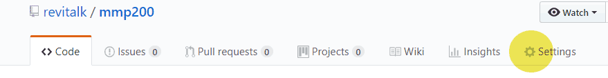
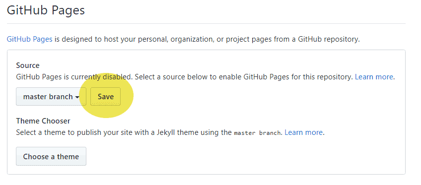

Make sure that you are using the latest version of the Chrome browser
- Log in to Github.com with your username and password
- Create a new repository named mmp200. Check "Initialize this repository with a README"

  

- Open the new repository and click on Setting.

  

- Scroll down all the way to Github Pages, under 'source' click on the dropdown menu and select 'master branch' and save.

  

- Click on the 'code' tab to go back to the repository files.

- To upload your files drag and drop the files, or the folder containing them, onto the repository. Click Commit.

- The files URL is: username.github.io/repositoryname/foldername/filename.
