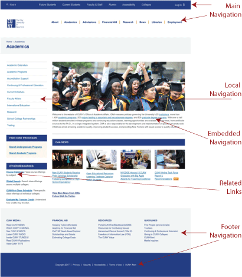

### Main Navigation

- The main navigation lets visitors know what is available on the site.
- It allows people to quickly switch to different sections of the site.
- The consistent presence of the main navigation helps visitors navigate the site efficiently.
- It helps visitors understand where they are in the site’s hierarchy.
- Main navigation is an important part of the interface of the site.

### Local Navigation

- Local navigation provides access to other options within one category, at one level of a hierarchy.
- local navigation should be designed differently than the main navigation to reinforces its secondary nature.
- Local navigation exposes the granularity and depth of the topic at hand.

### Contextual Navigation

**Embedded navigation**

- Contextual navigation may be embedded within the text itself.
- Contextual navigation is often represented as plain text links.

**Related links**

Contextual navigation may appear as a sidebar.

### Footer Navigation

- footer navigation is located at the bottom of the page and is usually represented by text links.
- It usually links to additional information outside the main topic of the site, such as copyright information, terms and conditions, and site credits.
- The footer may include links to topics that do not serve the primary target audience of the site, or the main goals of the site.
- Another common practice is to include part or all of a site map in the footer navigation.

[Read more about types of navigation](https://www.safaribooksonline.com/library/view/designing-web-navigation/9780596528102/ch04.html).
